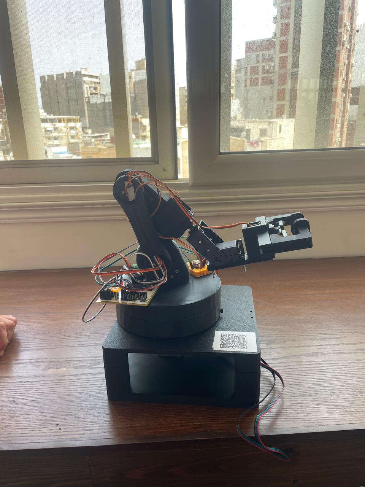
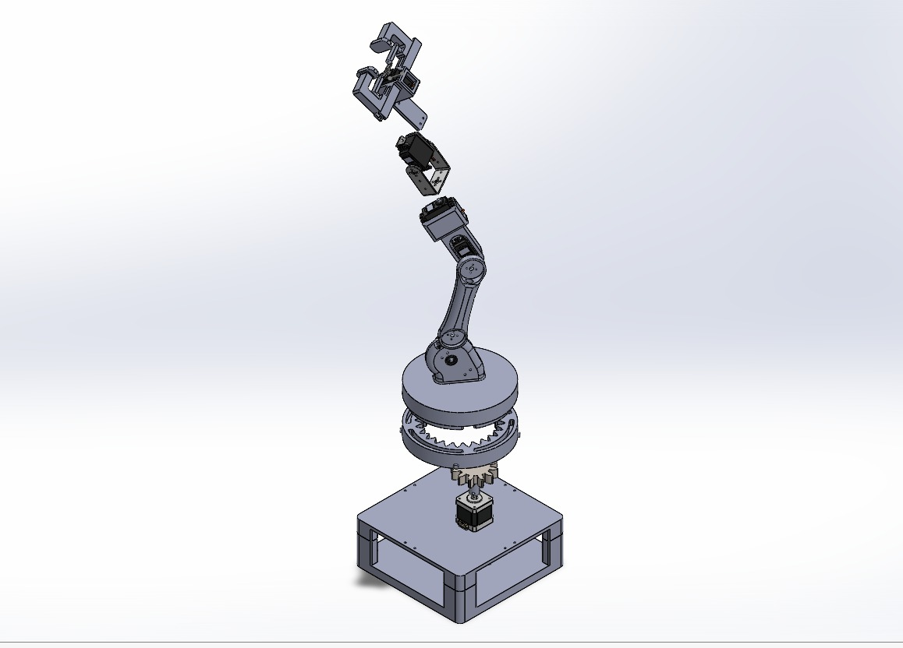

# 🤖 Industrial Robotics Project

Welcome to our Industrial Robotics project repository!  
This project was developed as part of the Industrial Robotics course submission and focuses on building, controlling, and simulating a robotic arm system using modern robotics tools and embedded systems.

---

<table>
<tr>
<td>



</td>
<td>



</td>
</tr>
</table>

---

## 🚀 Project Overview

The project combines:

- 🦾 Robotic arm design and control
- ⚙️ ROS 2 integration
- 🎮 Motion planning with MoveIt
- 🔌 Arduino/ESP32 communication
- 🖥️ Simulation and visualization
- 📡 Serial/UART communication

The goal is to create a smart and flexible robotic manipulation system capable of performing automated movements and task execution.

---

## 🛠️ Technologies Used

- ROS 2
- MoveIt 2
- Gazebo
- RViz
- Arduino / ESP32
- Python
- C++
- UART Serial Communication
- MATLAB / Simulink
- micro-ROS
- SolidWorks

---

## 📂 Repository Structure

```text
src/
 ├── robot_description/
 ├── robot_control/
 ├── moveit_config/
 ├── serial_communication/
 └── simulation/

firmware/
cad/
stl/
matlab/
pcb/
media/
docs/
```

# Full Stack Robotic Arm System

A complete full-stack robotic arm platform integrating mechanical design, simulation, motion planning, embedded control, and real hardware execution using ROS 2, MoveIt 2, Gazebo, ESP32, MATLAB/Simulink, Arduino, and SolidWorks.

---
