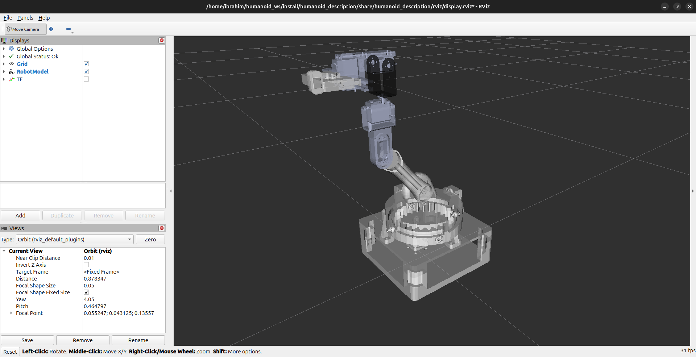
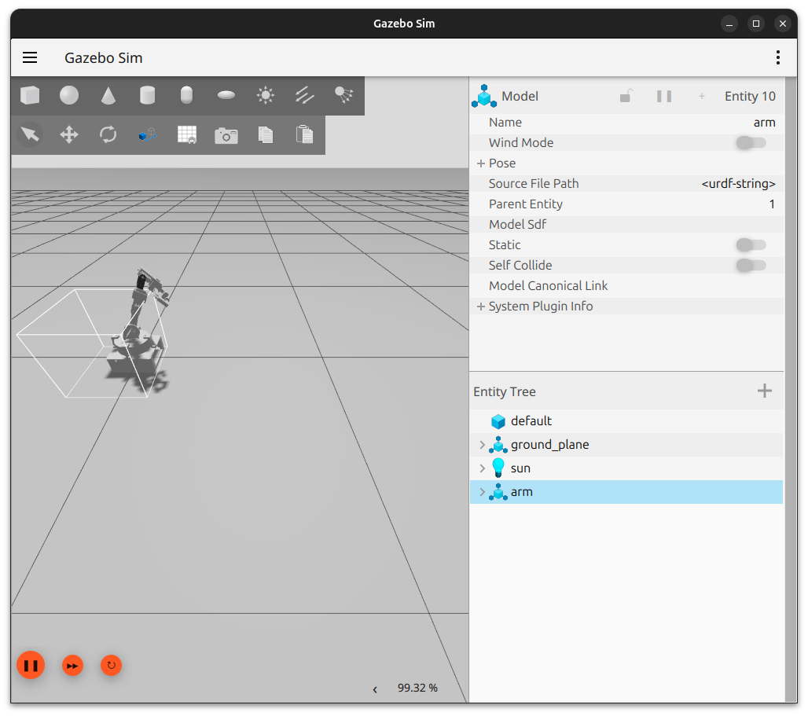
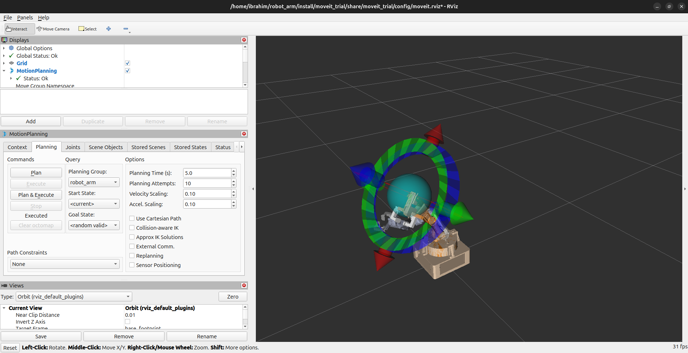

#ROS2 Workspace (MoveIt 2 + Gazebo + ESP32 Control Stack)

This workspace contains the complete ROS 2 control pipeline for the robotic arm project, including:

- Robot visualization using RViz
- Motion planning using MoveIt 2
- Physics simulation using Gazebo
- Real hardware communication using micro-ROS and ESP32
- Joystick-based gripper control
- Joint state to servo angle conversion

The stack was initially generated using **MoveIt Setup Assistant** and later extended with custom launch files and control nodes for hardware integration.

---

# System Pipeline

```text
MoveIt 2
    │
    v
ROS 2 Controllers
    │
    v
/joint_states
    │
    v
control_micro node
    │
    v
micro-ROS Agent
    │
    v
ESP32
    │
    v
Servo Motors / Gripper
```

---

# Workspace Features

- Full MoveIt 2 integration
- Gazebo simulation support
- RViz visualization
- ESP32 hardware communication
- micro-ROS WiFi bridge
- Real-time joint state conversion
- Servo angle mapping
- Joystick gripper control
- Parallel simulation + hardware testing

---

# ROS2 Packages

| Package | Description |
|---|---|
| `arm_description` | URDF/Xacro robot model + launch files |
| `arm_moveit_config` | MoveIt Setup Assistant generated package |
| `arm_control` | Joint state to servo conversion node |
| `micro_ros_interface` | ESP32 communication layer |
| `gazebo_simulation` | Gazebo simulation integration |

---

# Running the Project

## 1. Launch RViz and Verify Robot URDF

```bash
# Launch RViz and visualize robot model
ros2 launch arm_description display.launch.py
```

### RViz Screenshot



### RViz Demo Video

<video src="../media/videos/rviz.mp4" controls width="800"></video>

---

## 2. Launch Gazebo + MoveIt 2 Simulation

```bash
# Launch Gazebo simulation + MoveIt motion planning
ros2 launch arm_description moveit_gazebo.launch.py
```

### Gazebo Screenshot



### MoveIt Screenshot



### Gazebo Demo Video

<video src="../media/videos/gazebo.mp4" controls width="800"></video>

### MoveIt Demo Video

<video src="../media/videos/moveit.mp4" controls width="800"></video>

### Gazebo Mimicking MoveIt Motion

<video src="../media/videos/moveit_gazebo_sync.mp4" controls width="800"></video>

---

## 3. Run Joint State → Servo Control Node

```bash
# Convert joint states into servo angles for ESP32
ros2 run arm-control control_micro
```

This node:
- Subscribes to `/joint_states`
- Converts joint angles into servo-compatible commands
- Publishes processed angles for ESP32 execution

---

## 4. Launch Joystick Control

```bash
# Launch joystick node for gripper control
ros2 run joy joy_node
```

This node allows:
- Manual gripper opening/closing
- Real-time joystick interaction

---

## 5. Run micro-ROS Agent (WiFi Mode)

```bash
# Start micro-ROS UDP bridge
ros2 run micro_ros_agent micro_ros_agent udp4 --port 8888
```

This creates the communication bridge between:
- ROS 2 host machine
- ESP32 micro-ROS client firmware

---

# ESP32 Firmware Configuration

Before running WiFi mode, edit the firmware located at:

```text
firmware/robot_arm_trial2/
```

Update the network parameters for ros transports in setup function 
---

# Recommended Startup Order

```text
1. Start micro-ROS agent
2. Launch RViz (optional URDF verification)
3. Launch Gazebo + MoveIt
4. Run control_micro node
5. Launch joystick node (optional)
```

---

# Topics

## Input Topics

| Topic | Type | Description |
|---|---|---|
| `/joint_states` | `sensor_msgs/JointState` | Joint positions from controllers |

---

## Output Topics

| Topic | Type | Description |
|---|---|---|
| `/servo_angles` | Custom / std_msgs | Servo commands sent to ESP32 |

---

# Dependencies

- ROS 2 Jazzy / Humble
- MoveIt 2
- Gazebo
- RViz
- micro-ROS
- `joy` package
- Python3 / `rclpy`

---

# Notes

- MoveIt Setup Assistant used for initial robot configuration
- Gazebo and MoveIt launched together through custom launch file
- ESP32 receives commands over WiFi using UDP micro-ROS
- System supports both simulation and real hardware execution
- Servo mapping depends on physical calibration

---

# Future Improvements

- Encoder feedback integration
- Closed-loop control
- Force/torque sensing
- Trajectory smoothing
- Computer vision integration
- Autonomous pick-and-place pipeline

---# ROS2 Workspace (MoveIt 2 + Gazebo + ESP32 Control)

This directory contains the ROS 2 control stack for the robotic arm, including simulation, motion planning, and real hardware execution using micro-ROS.

The system was generated using **MoveIt Setup Assistant** and extended with custom nodes for real-time joint control and ESP32 integration.

---

# Overview

This ROS 2 stack is responsible for:

- Robot description (URDF/Xacro)
- Motion planning using MoveIt 2
- Simulation in Gazebo
- Visualization in RViz
- Joint state monitoring
- Conversion of joint states → servo commands
- Communication with ESP32 via micro-ROS

---

# System Pipeline

```text
MoveIt 2 (Motion Planning)
        │
        v
Joint Trajectory Controller (ROS2)
        │
        v
Joint States Topic (/joint_states)
        │
        v
Custom ROS2 Node
(joint_state_to_servo)
        │
        │ converts joint angles → servo angles
        v
Micro-ROS Publisher
        │
        v
micro-ROS Agent (PC side)
        │
        v
ESP32 Subscriber
        │
        v
Servo Motors


# Running the Project (ROS2 Stack)

## Full Launch Commands

```bash
# 1. Launch RViz and visualize the robot URDF (check robot model, joints, and TF tree)
ros2 launch arm_description display.launch.py

# 2. Launch Gazebo simulation + MoveIt 2 motion planning (full simulated robot control stack)
ros2 launch arm_description moveit_gazebo.launch.py

# 3. Run custom control node that converts /joint_states into servo angles for ESP32
ros2 run arm-control control_micro

# 4. Launch joystick driver to control gripper/clamp manually
ros2 run joy joy_node

# 5. Start micro-ROS agent (UDP over WiFi) to bridge ROS2 and ESP32 firmware
ros2 run micro_ros_agent micro_ros_agent udp4 --port 8888
